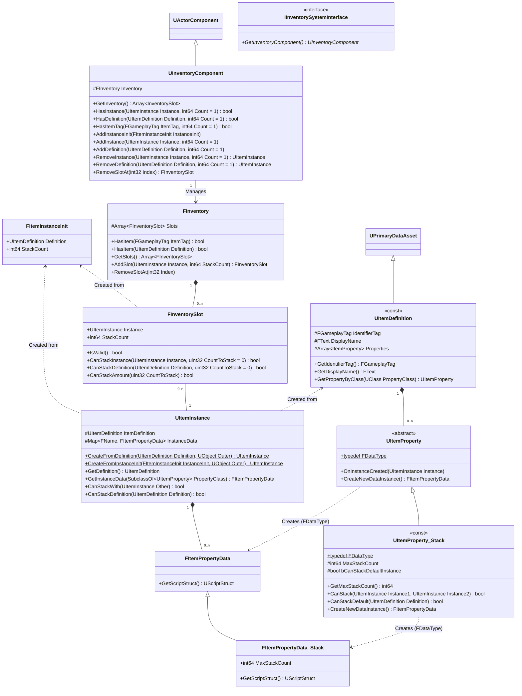
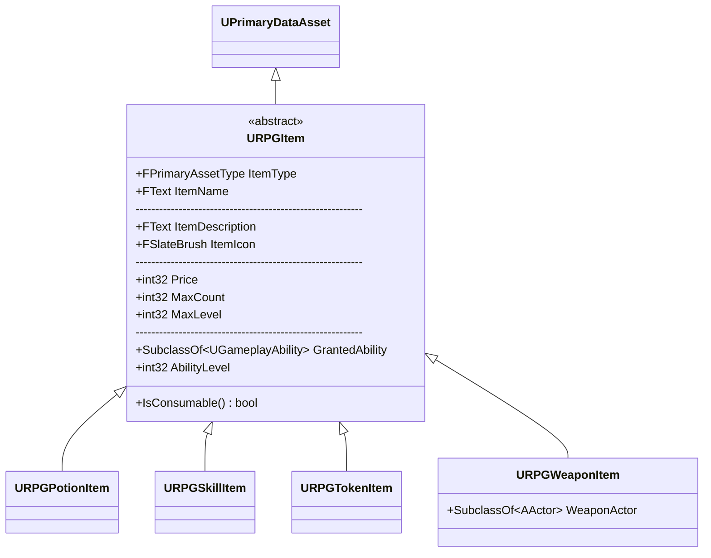
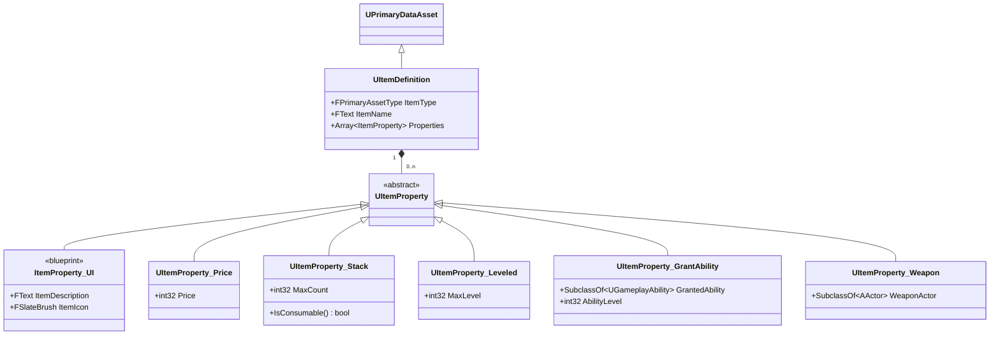

# Inventory System

This is a document describing the design of the inventory system.

| Metadata Field | Value      |
|----------------|------------|
| Managed by     | Dohyun Kim |
| Last update    | 2022-06-16 |

## Overview

The inventory system is implemented in the `Inventory System` plugin in `Plugins/GameSystems/InventorySystem` in the project. This enables us to reuse the system in other projects and test the core functionalities in isolation.

For the moment, there is only one module named `InventorySystem`. An editor module (`InventorySystemEditor`) might be created in the future to improve asset editing experience.

### Core Concepts

<dl>
  <dt>Item Definition</dt>
  <dd>A definition of what a type of item can do. It can be thought that an item definition declares and defines a type of item. It holds several item properties.</dd>
  <dt>Item Property</dt>
  <dd>A fragment of an item definition, usually created to serve a specific responsibility. For example, a gun weapon could consist of a "ranged weapon" property and an "ammo loader" property.</dd>
  <dt>Item Instance</dt>
  <dd>An item "instance" that exists in the game world. An item definition can be thought of a "class" for an item which can be used to create several class "instances". Each instance can have a separate state. For example, weapons and armors might provide random values of stats for each instance where the ranges are defined in the item definition.</dd>
  <dt>Item Instance Data / Item Property Data</dt>
  <dd>The runtime data specific for the item instance it is owned by. It is also called "property data" because each item property determines what data to store and how to manage the values in the data. For example, if there is an item property for the durability of an equipment, that property will create an object instance of the data type that can represent the currently remaining durability value of the item instance.</dd>
  <dt>Inventory</dt>
  <dd>A container capable of possessing, keeping, and discarding items.</dd>
  <dt>Inventory Component</dt>
  <dd>An actor component that is responsible for managing the inventory of the actor.</dd>
</dl>

### Class Relationships

The following diagram shows the overall structure of the system. It does not show fields and methods that are meant for internal logic handling.



## Item Definitions and Item Properties

### Design Principle: Composition Over Inheritance

This part is taken and adapted from *Lyra Starter Game* sample project.

#### A Look at an Implementation Using Inheritance

The goal of the design of an item definition having a collection of item properties is to utilize composition instead of inheritance. The *ActionRPG* sample project uses inheritance for defining items, which can be shown with the diagram below.



While this approach might feel more intuitive at first, it has a few shortcomings that can reduce the productivity of the project development especially in the later days.

1. **The required fields in the item definitions are hardcoded into the C++ source file.** While this might not be a big deal in a small team like ours with a lot of programmers knowing how to program in C++, it still requires more time to iterate over various configurations we'd like to try out. It is also worth considering the fact that refactoring the fields in C++ brings more likelihood to break the references in the binary asset files.
1. **Item behaviors are implemented by creating child classes of the base `URPGItem` class.** This might be okay for very simple functionalities, but it shuts off the possibility for easily implementing shared behaviors. For example, what should we do if we want to prohibit some items from being discarded from the player's inventory? Probably create a boolean field on `URPGItem` class. What if we want to exclude some items from being counted for the inventory size limit? We need to add another field to `URPGItem` class. As you can see, as more functionalities are required, the base class keeps getting modified with extra responsibilities, and that brings us to the next point.
1. **The base class is likely to get monolithic with a lot of responsibilities to fulfill.** We can already see that in the `URPGItem` class where all of the fields that serve different purposes are gathered in one place. (I manually put a few separators to make that more obvious.) This makes it difficult to track down where specific functionalities are implemented which in turn makes debugging take extra time.

#### Observation of Using Inheritance

Even though items can be thought to be divided into categories, there are actually a lot of functionalities that must be implemented and shared among various types. What makes the implementation complicated is that the behaviors might be required to be different from one type of item to another, but that may or may not be related to the category of the items. Therefore, to simplify the development process and adapt quickly to changing requirements, our inventory system uses composition of "item properties" to define how each item behaves for specific gameplay functionalities.

#### Using Composition

Using the structure of our inventory system, the *ActionRPG* example can be modified as below.



A few notes about the diagram above:

1. Core fields like `ItemType` and `ItemName` are left in the base item definition.
1. UI-related properties are better fit for a blueprint class since it is for interacting with a system which is external to the inventory system and is likely to actively use blueprints.
1. Method `IsConsumable` is moved to `Stack` item property because the logic inside the function is to check `MaxCount <= 0`.
1. `MaxLevel` is moved to `Leveled` item property because I am not sure what it is used for specifically. There might be a better place to put this field in.

Now, what should we do if we want to make some items unable to be sold to NPC merchants? We could create a field `bool bCanBeSold` in `Price` item property. That way, the property class still stays with its responsibility for managing the "pricing" of the item, and all other things are unaffected. What if we need to prevent the player from destroying certain items? We can create a new item property class called `NoDestroy` with a field `bool bNoDestroyByDefault`. As a result, any items that do not need this functionality is not affected at all. Lastly, if we would like to exclude some items from the inventory size limit, we could either create another item property class, or we might just use `Stack` item property class and add another field to it.

### Creating Item Definitions

A new item definition must be created to add a new type of item. In an appropriate folder inside the `Content` folder, create a new asset `Data Asset` in `Miscellaneous` category. When a prompt pops up to choose the data asset class, select `ItemDefinition`.

You will see 2 base fields that you have to fill in: `Identifier Tag` and `Display Name`. Create a new tag for `Identifier Tag` and assign it. For `Display Name`, put in whatever will be displayed to the player as the item's name.

> `Identifier Tag` **MUST** be unique to each item definition. It is used as a way to identify the item type without checking the reference to the item definition object as well as using `FGameplayTagContainer` for a cheap collection of item types.

### Assigning Item Properties

Add or remove entries for `Properties` field. After selecting what item property class to use for the entry, you'll be able to edit the variables for that class.

> Make sure you assign only 1 entry per item property class. When querying for an item property instance by its class, only the first entry that can be cast to the class will be returned.

### Using Item Properties

To either check if an item definition contains a specific item property class or get a reference to the object instance of the class, use the method `GetProperty` on `UItemDefinition`.

```c++
if (UItemProperty_Stack* StackProperty = Definition->GetProperty<UItemProperty>())
{
	// Stack property exists; you can use it here
}
else
{
	// Stack property doesn't exist
}

// This is a more low-level one where you need to pass in a UClass
if (UItemProperty* Property = Definition->GetProperty(UItemProperty_Stack::StaticClass()))
{
	// Stack property exists, but you need to cast it manually if you want to access anything only defined in the Stack
	// property. This might be useful if you only want to check the existence, but the benefit isn't significant.
}
```

In blueprints, you can use `Get Item Property` node. The return type will be automatically set depending on what you assign to `Property Class`.

## Item Instances

An item definition is like a class for an item type, and an item instance is like an object instance but for that item. Most items might not need any extra care when they are in the game world. However, for some items like equipments or magazines, they might need to be treated separately as they could have "states" that need to be tracked.

For example, to implement a durability and repair system for equipments, we need to track the state for each equipment instance in the game world. Or in a multiplayer game with a crafting system, we might want to leave the information on who crafted the items. Whatever the case, a place to store the data about the state is required.

This is where the item instance data comes in.

### Item Instance Data

Since we have a separation of concerns through item properties, it is preferable to have each item property class manage its own data than to make the item instance do all of the work. This is why we have the field `TMap<FName, TUniquePtr<FItemPropertyData>> InstanceData` in the item instance class.

A few notes about this field:

1. The key type `FName` is taken from the name of class of the item property. Do not try to manually write the value. Instead, use `GetFName` method on the `UClass` class. For example, `Property->GetClass()->GetFName()`.
2. `TUniquePtr` is used because we need to utilize polymorphism in order to support storing dynamic types, which means that we cannot store a raw type and instead use a pointer. Storing a raw pointer requires manual memory management, so we're using a smart pointer to prevent memory leak and have cleaner code. Since the property data is owned by the item instance, a unique pointer is enough for this case.
3. To be precise, the "instance data" is the whole map variable, while "property data" is the data that is specific to a property class.
4. Currently, accessing this in blueprints is not supported. A custom blueprint node must be created to support the polymorphism. An alternative method is to use `UObject` instead of a raw struct for the property data, but a profiling must be done to ensure that it does not bring a negative impact on performance.

### Using Item Instance Data

To get access to the item property data stored by a specific item property class, use `GetPropertyData` method on `UItemInstance`. Using the method on a const pointer variable will only return a const reference to the data instance. Make sure to check for a `nullptr` value when you get the data.

Just like `GetProperty` method of `UItemDefinition`, there is also a low-level alternative that requires the `UClass` instance of the item property class as an in put and returns a pointer to the base `FItemPropertyData` type.

```c++
if (FItemPropertyData_Stack* StackData = Instance->GetPropertyData<UItemProperty_Stack>())
{
	// The data is found
}
else
{
	// The data is not found
}
```

Accessing the data in blueprints is currently not supported.

### Creating a New Property Data Type

When you create a new C++ class of item property, you must follow certain rules. More details on that is written in the documentation blocks for `UItemProperty` and `FItemPropertyData`. You can also take a look at an example with `UItemProperty_Stack` and `FItemPropertyData_Stack`.

## Improvements to Make

- [ ] A different way of storing inventory slots
  - Currently, the inventory is just an array of inventory slots. This slows down operations on the inventory as the operation time is at least *O(n)*. Frequent reallocation of the elements is also problematic as it sometimes brings the time to *O(n^2)* or larger.
- [ ] Auto sort of inventory slots
  - Closely related to the point above in terms of implementation details.
- [ ] Serialization of instance data and inventory
  - This is required for saving and loading games.
- [ ] More customizable "stackability" checks
- [ ] A different way of storing item properties in item definitions
  - This might not be a significant problem since the properties arrays won't be very long most of the time, but it is worth checking if the array method is good enough. It is also difficult to enforce "1 entry per class" rule. If we change this, it is worth considering creating an editor module with a custom editor class for managing item properties in the item definition editor.
- [ ] Add more event callbacks to item properties
  - Ex) when an instance added to an inventory, when an instance is removed from an inventory, when an instance is being destroyed, etc.
- [ ] Delegates for changes in the inventory
  - This is especially useful for UI.
- [ ] Blueprint access to item instance data
  - It should be figured out how to define the data type for blueprint-created item property classes.
  - A custom blueprint node might be needed for `GetPropertyData` method of `UItemInstance`.
